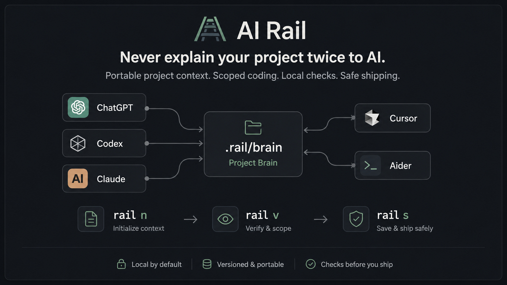

# AI Rail

[](https://github.com/afshinsb/ai-rail/actions/workflows/tests.yml)
[](pyproject.toml)
[](LICENSE)
[](docs/RELEASE.md)

**Never explain your project twice to AI.**

AI Rail is a local-first CLI that keeps AI-assisted development focused, repeatable, and safe.

It gives every Git repo a portable project brain, a simple daily workflow, and scoped prompts for tools like ChatGPT, Codex, Claude, Cursor, and Aider - so you can move between AI tools without re-explaining the codebase, losing context, or letting the coding agent drift into unrelated files.

```text
rail n  -> start the next scoped task
rail v  -> review, run local checks, and create an audit prompt
rail s  -> safely commit, push, close, and sync
rail h  -> continue in a new AI chat with full project context
```

AI Rail keeps the coding agent on the active issue, keeps an AI reviewer such as ChatGPT, Claude, or another LLM in the review loop, and lets your own machine run the tests - saving tokens, reducing over-coding, and making AI development feel controlled instead of chaotic.

<p align="center">
  
</p>

## Who This Is For

AI Rail is for developers who:

- use more than one AI coding tool on the same repo
- want GitHub Issues to be the task source of truth
- want repeatable prompts, review packs, checks, and handoffs
- prefer local-first tooling over hosted workflow state
- work solo or in small repos where conservative commit safety matters

## What AI Rail Is Not

AI Rail is not:

- an AI model, agent runtime, or hosted service
- a replacement for Git, GitHub Issues, or your test suite
- a project management system for large teams
- a tool that sends code to a remote service by itself
- a way to bypass review, checks, or secret-file safety

## Install

AI Rail is currently alpha software.

## Prerequisites

- Python 3.10+
- `pipx` for installing the `rail` CLI
- Git with a configured remote
- GitHub CLI (`gh`) installed and authenticated with `gh auth login`

AI Rail uses Git for repository state and delegates GitHub Issue operations to `gh`.

Recommended public install:

```bash
pipx install ai-rail
```

Verify:

```bash
rail --version
rail demo
```

If `pipx` is not installed yet:

```bash
python -m pip install --user pipx
python -m pipx ensurepath
```

Restart your terminal, then run:

```bash
pipx install ai-rail
```

Latest source from GitHub:

```bash
pipx install git+https://github.com/afshinsb/ai-rail.git
rail --version
```

Contributor install from this source checkout:

```bash
git clone https://github.com/afshinsb/ai-rail.git
cd ai-rail
python -m pip install -e ".[dev]"
rail --version
```

## Quick Demo

Print the built-in walkthrough:

```bash
rail demo
```

Try the bundled demo app:

```bash
cd examples/demo-todo
rail init --stack node --project-name "AI Rail Demo TODO"
rail doctor
npm run check
gh issue create --title "Add todo body validation" --body-file issues/001-add-body-validation.md
rail next --copy
```

## 60-Second Quickstart

Inside any Git repo:

```bash
rail init --stack node --project-name "My Project"
rail doctor
rail resume
```

> **Security:** `rail verify` runs the check commands from `.rail/config.json` using the system shell.
> Review `.rail/config.json` before running checks in repositories you did not author.

Daily loop:

```bash
rail next --copy
# paste/run the generated prompt in your AI coding tool
rail verify --copy
# paste the generated review prompt into an AI reviewer for audit
rail ship "type(scope): message"
```

Short alias loop:

```bash
rail n
# paste/run the generated prompt in your AI coding tool
rail v
# paste the generated review prompt into an AI reviewer for audit
rail s "type(scope): message"
```

When switching AI tools or opening a new chat:

```bash
rail snapshot
rail handoff --for chatgpt --include-review --include-checks --copy
```

To update tool-specific AI instruction files from the same project brain:

```bash
rail export
```

## Core Commands

| Command | Purpose |
|---|---|
| `rail init` | Add AI Rail files to a repo |
| `rail resume` | Show where you stopped |
| `rail next` | Start the next issue and generate the first prompt |
| `rail handoff` | Generate portable context for another AI session/model |
| `rail verify` | Capture review info, run checks, and generate an audit prompt |
| `rail ship` | Commit, push, close the issue, mark done, and sync |
| `rail snapshot` | Refresh `.rail/brain/` project-brain files |
| `rail export` | Generate `AGENTS.md`, `CLAUDE.md`, Cursor rules, `AIDER.md`, and Copilot instructions |
| `rail demo` | Print the public demo script |
| `rail release-check` | Check packaging/docs readiness |

Common aliases are thin wrappers over the long commands: `rail r` for `resume`, `rail n` for `next --copy`, `rail v` for `verify --copy`, `rail s` for `ship`, `rail snap` for `snapshot`, `rail h`/`hc`/`hg`/`hl` for handoffs, `rail x`/`xd`/`xf` for exports, and `rail rc` for `release-check`.

Detailed commands such as `rail start`, `rail prompt`, `rail review`, `rail checks`, `rail commit`, `rail issue-close`, `rail done`, and `rail sync` remain available for manual control.

## Portable Project Brain

`rail snapshot` writes:

```text
.rail/brain/PROJECT.md
.rail/brain/CURRENT_TASK.md
.rail/brain/STATUS.md
.rail/brain/RECENT_HISTORY.md
.rail/brain/HANDOFF.md
```

`rail handoff --for codex|chatgpt|claude|cursor|aider --copy` turns that brain into a paste-ready handoff so a new AI session can continue from the current project state.

## Tool-Specific Exports

`rail export` turns the single AI Rail project brain into files that different AI coding tools already know how to read:

```text
AGENTS.md
CLAUDE.md
AIDER.md
.cursor/rules/ai-rail.mdc
.github/copilot-instructions.md
```

Exports are safe by default. AI Rail updates its own managed block when markers are present, but refuses to overwrite existing human files unless you pass `--force`, which first writes a `.rail.bak` backup.

## Safety Defaults

`rail ship` refuses unsafe commits by default when:

- the review pack is missing or stale
- checks are missing, failed, or stale
- dangerous/generated files such as `.env`, keys, local databases, `node_modules/`, `dist/`, or `.rail/state/` are changed

Escape hatches exist for advanced users, but the normal path is intentionally conservative.

## Local-First Privacy

AI Rail does not send your code anywhere by itself. It shells out to `git`, `gh`, and your configured local checks.

By default, `.rail/state/history.jsonl` is ignored by git to avoid committing personal workflow history into team repos.

License: Apache License 2.0.

## Author

- Afshin Saberi
- GitHub: https://github.com/afshinsb
- Website: https://theafshin.com

## Docs

- [Quickstart](docs/QUICKSTART.md)
- [Install](docs/INSTALL.md)
- [Commands](docs/COMMANDS.md)
- [Workflows](docs/WORKFLOWS.md)
- [Architecture](docs/ARCHITECTURE.md)
- [Release checklist](docs/RELEASE.md)
- [Roadmap](docs/ROADMAP.md)
